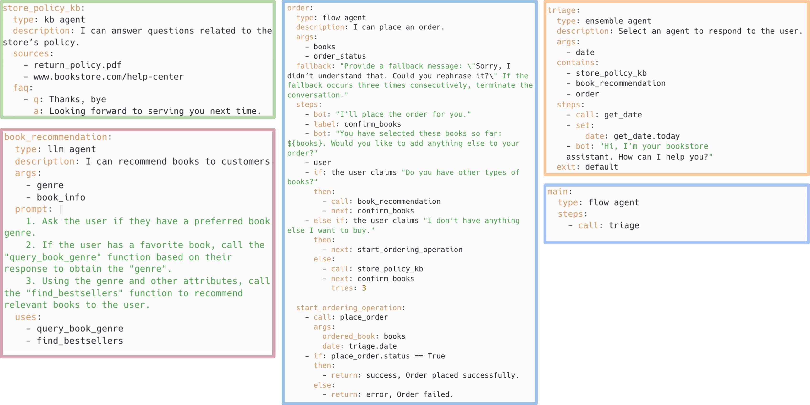
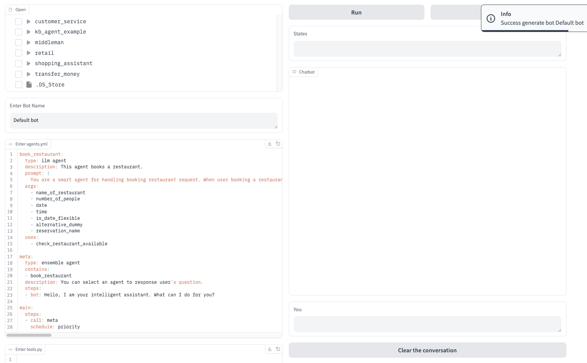
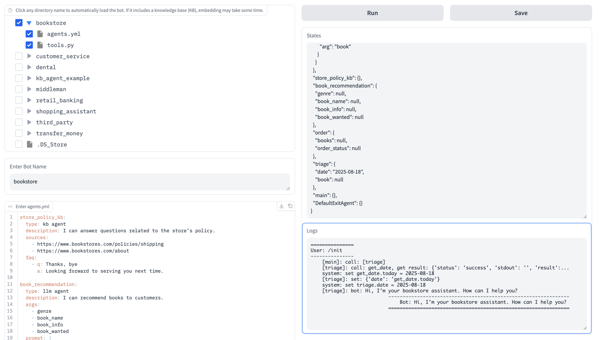
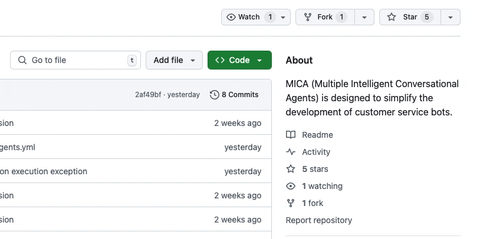

<p align="center">
  <a href="https://arxiv.org/abs/2504.14787">ADL Language</a> ·
  <a href="https://mica-labs.github.io/">Documentation</a>  ·
  <a href="https://www.promptai.us">Mica studio</a>
</p>

## Agent Declarative Language
There are numerous agent frameworks available—such as [AutoGen](https://github.com/microsoft/autogen), [CrewAI](https://github.com/crewAIInc/crewAI), [LangChain](https://github.com/langchain-ai/langchain), [Amazon MAO](https://github.com/awslabs/multi-agent-orchestrator), and [Swarm](https://github.com/openai/swarm) —these frameworks offer high flexibility for constructing agents in general settings. However, they are overly complex for professionals in the customer service domain. For example, when business logic needs to be updated, users are required to modify low-level Python code.  To address this, we introduce Agent Declarative Language (ADL)—a lightweight language that offers a dedicated abstraction layer that could make the maintenance of customer service bots much easier. In ADL, users can simply revise and share agent.yaml files, which encapsulate the entire logic in a declarative and human-readable format. 

Below is a bookstore chatbot described in ADL. This chatbot includes three agents: a book recommendation agent, an order placing agent, and an agent responsible for FAQs and bookstore policy. Everything is described in one file except a few function calls connecting to different services. 



ADL emphasizes three key characteristics: declarative language, modular design, and natural language oriented—features that are largely overlooked in existing frameworks. It is designed to simplify the development of customer service bots.  Please refer to [ADL](https://arxiv.org/abs/2504.14787) for language specification. MICA (Multiple Intelligent Conversational Agents) can interpret and run programs written in ADL.  

## Quick Start
> Before installing MICA, make sure your machine meets the following minimum system requirements:
>
>- Python >= 3.9
>- OpenAI API Key

</br>

The easiest way to start using MICA is through the local GUI frontend:

```bash
# Install dependencies
pip install -r requirement.txt

# Set OpenAI API key
export OPENAI_API_KEY=<your key>

# Start the service
python -m mica.demo
```

After running, you can access the MICA dashboard in your browser at [http://localhost:7860](http://localhost:7860) and start designing your bot.

> If the port `7860` is occupied, another port will be assigned automatically, and the specific address will be displayed in the logging information.

## Key Features

**1. Multi-Agent System**:
Design and implement complex conversational systems with multiple agents that work together to handle customer service tasks.

**2. Natural Language Configuration**:
Define your agents using simple natural language descriptions without complex coding.

**3. Real-time Editing**:
Customize your bot through an intuitive interface with immediate feedback.



**4. Local Examples**:
Load pre-built bots from local examples to jumpstart your development.



**5. State Tracking**:
Monitor the conversation state and agent arguments in real-time.


**6. Local Deployment**:
Deploy your bot as a service on your own infrastructure.

## Using MICA

### Local GUI Frontend

The local GUI provides features for online editing, testing, loading bots from local files, and saving bots to local storage.

#### Real-time Editing
You can customize your bot on the left side of the page. After editing, click the `Run` button at the top right to generate the bot. If the generation fails, an alert will be displayed. Please check if your agents' format is correct.

#### Load from Local Examples
You can also load a bot from local examples and modify it as needed. After selecting the bot you want to load, you can start a conversation immediately or modify it further.

> Note: If you modify the examples, you need to click the `Run` button before testing the latest bot. Additionally, selecting multiple directories at the same time will cause a bot loading error. When deselecting, all unsaved changes will be lost immediately.

#### Conversation and State
Once the bot is generated, you can start a conversation with it. Enter your message in the `You` dialog box and press `Enter` to send it. The `Clear the conversation` button clears the conversation history and also resets the `States` panel. The `States` panel displays the current argument values for each agent in the bot.

#### Save to Local
You can save all bots from the left panel to a local file. Clicking the `Save` button will save the current bot information (excluding conversation and state data) to the local folder `../bot-output`. A folder named after the bot will be created, with `agents.yml` storing the agents' information and `tools.py` storing the Python code.

### Server Deployment

If you need to deploy the bot as a service, you can set up a server using the following steps:

```bash
# Install dependencies
pip install -r requirement.txt

# Set OpenAI API key
export OPENAI_API_KEY=<your key>

# Start the service
python -m mica.server
```

## Staying ahead

Star Mica on GitHub and be instantly notified of new releases.



## License

Licensed under the Apache License, Version 2.0. Copyright 2025 Mica-labs. [Copy of the license](LICENSE.txt)
