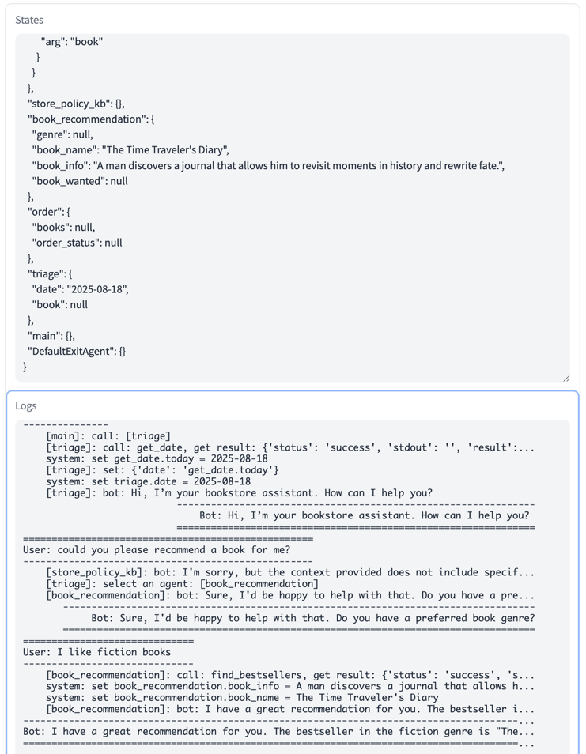

# MICA
MICA (Multiple Intelligent Conversational Agents) is designed to simplify the development of customer service bots. You can quickly implement your multi-agent chatbot system by following some simple natural language descriptions.

## Documentation
You can access MICA's documentation [here](https://mica-labs.github.io/).

## Local GUI Frontend
You can design and test the bot through a local GUI, which requires Python 3.8 or higher. Please execute the following command to install the required dependencies:
```bash
pip install -r requirement.txt
```
Set the OPENAI KEY.
```bash
export OPENAI_API_KEY=<your key>
```
Then, start the service:
```bash
python demo.py
```
You can visit `http://localhost:8760` and start to design.

## GUI Feature Introduction
The local GUI provides features for online editing, testing, loading bots from local files, and saving bots to local storage.

### Real-time Editing
You can customize your bot on the left side of the page. After editing, click the `Run` button at the top right to generate the bot.  
  
If the generation fails, an alert will be displayed. Please check if your agents' format is correct.  


### Load from Local Examples
You can also load a bot from local examples and modify it as needed. After selecting the bot you want to load, you can start a conversation immediately or modify it further. Please note that if you modify the examples, you need to click the `Run` button before testing the latest bot. 
Additionally, please note that selecting multiple directories at the same time will cause a bot loading error. When deselecting, all unsaved changes will be lost immediately.


### Conversation and State
Once the bot is generated, you can start a conversation with it. Enter your message in the `You` dialog box and press `Enter` to send it. The `Clear the conversation` button clears the conversation history and also resets the `States` panel. The `States` panel displays the current argument values for each agent in the bot.  


### Save to Local
You can save all bots from the left panel to a local file. Clicking the `Save` button will save the current bot information (excluding conversation and state data) to the local folder `../bot-output`. A folder named after the bot will be created, with `agents.yml` storing the agents' information and `tools.py` storing the Python code.

## Locally Deployment
If you need to deploy the bot as a service, you can set up a server using the following steps.  
First, ensure your Python version is 3.8 or higher. The process is similar to the GUI setup:

```bash
pip install -r requirement.txt
```
Set the OpenAI API key:
```bash
export OPENAI_API_KEY=<your key>
```
Finally, start the service:
```bash
python server.py
```
If you want to run the service in the background, you can use the following command. All logs will be stored in server.log in the current directory.
```bash
nohup python -u server.py > server.log 2>&1 &
tail -f server.log
```
